# Perfecting-Your-Drawing
Many drawing tools, such as iPad, have a function that when you are drawing a shape by hand, they will guess what it is, and make the best fit one to replace it. For example, if you draw a lopsided circle, it will produce a perfect one for it. In this project, i do that using the magic from linear algebra.

## Table of Contents
* [implement.py](#implement)
* [implement5.py](#implement5)

https://user-images.githubusercontent.com/86723888/153242357-727e216b-bbc3-48b5-ab18-b952909e5bd3.mp4

## implement
### introduce
- to find best fitting circle:  
uses "numpy.linalg.lstsq" to solve the least square problem.

- to find best fitting ellipse:  
using least square algorithm with the formula   
" c1 x^2 + c2 xy + c3 y^2 + c4 x + c5 y  =  1 ".  
The formula can actually fit all kinds of curves from conic section.

### demo for circle
- example1:

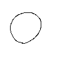

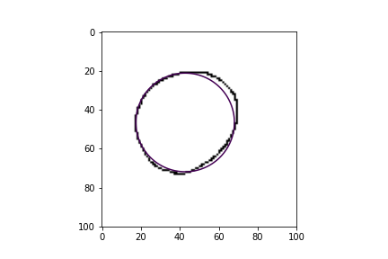

- example2:

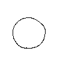

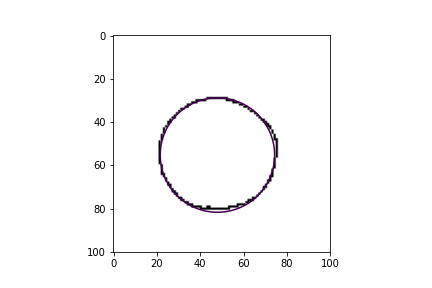

- example3:

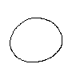

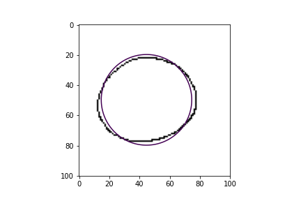

### demo for ellipse
- example1:

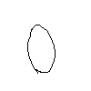

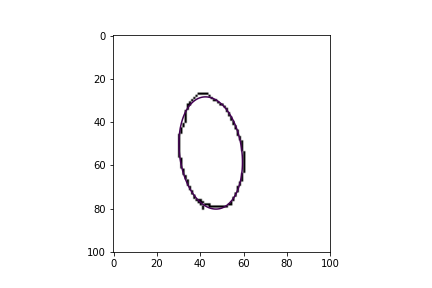

- example2:

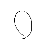

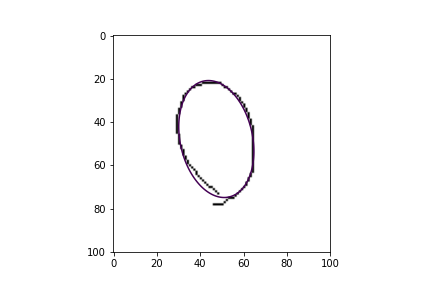

- example3:

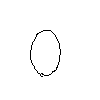

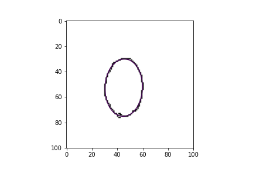

## implement5
### introduce
- find the minimum enclosing circle for the given points.

### demo
- example1:

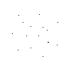

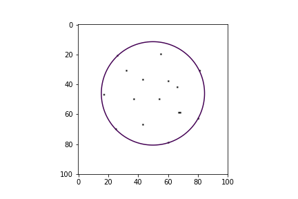

- example2:

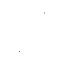

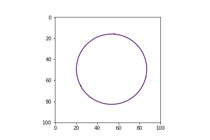

- example3:

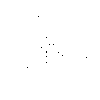

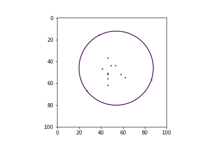

- example4:

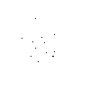

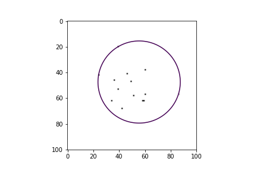
